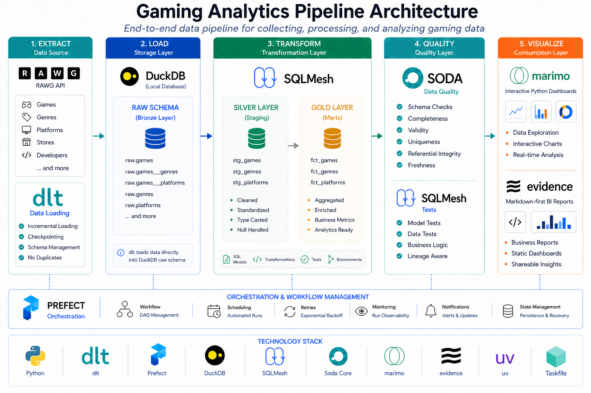

# Gaming Analytics Pipeline

[](https://github.com/mohamed-boughattas/gaming-analytics-pipeline/actions/workflows/ci.yml)
[](https://www.python.org/downloads/)
[](https://opensource.org/licenses/MIT)
[](https://github.com/astral-sh/ruff)
[](https://sqlfluff.com/)
[](https://github.com/astral-sh/ty)
[](https://dlthub.com/)
[](https://soda.io/)
[](https://sqlmesh.com/)
[](https://marimo.io/)
[](https://duckdb.org/)


A modern data engineering pipeline for collecting, processing, and analyzing gaming data from the RAWG API.

## 🎯 Overview

This pipeline provides end-to-end data engineering capabilities for gaming analytics:

- **Data Ingestion**: Extract data from RAWG API using dlt
- **Data Orchestration**: Manage workflows with Prefect
- **Data Quality**: Validate data with Soda Core + SQLMesh tests
- **Data Transformation**: Transform data with SQLMesh
- **Data Visualization**: Present insights with Marimo and Evidence dashboards

## 🏗️ Architecture



## 📈 Data Lineage

For detailed documentation of data flow and transformations, see [docs/data-flow.md](docs/data-flow.md).

## 🛠️ Tool Selection & Trade-offs

This project demonstrates a modern data engineering stack with intentional tool selection:

| Layer                | Tool           | Why Chosen                                                                                  | Alternative                     |
| -------------------- | -------------- | ------------------------------------------------------------------------------------------- | ------------------------------- |
| **Ingestion**        | dlt            | Code-defined sources, checkpoint-based incremental loading, automatic schema, no duplicates | Fivetran, Airbyte               |
| **Storage**          | DuckDB         | Embedded analytics DB, zero config, fast queries                                            | PostgreSQL, ClickHouse          |
| **Transformation**   | SQLMesh        | Virtual environments for dev/prod parity, built-in testing, no Jinja                        | dbt (popular, separate testing) |
| **Quality**          | Soda + SQLMesh | Defense in depth: declarative contracts + transformation tests                              | Single tool (less coverage)     |
| **Orchestration**    | Prefect        | Python-native, task retries with backoff, great DX                                          | Airflow (heavier, Java-centric) |
| **Dashboard (Tech)** | Marimo         | Reactive Python notebooks, interactive                                                      | Streamlit, Jupyter              |
| **Dashboard (Biz)**  | Evidence       | Markdown-first BI, static HTML output, dual audience                                        | Rill, Metabase                  |
| **Package Manager**  | uv             | 10-100x faster than pip, lockfile                                                           | pip, Poetry                     |
| **Build Tool**       | Taskfile       | YAML-based, cross-platform, dependency-aware task runner                                    | Make, Just                      |

This stack demonstrates **modern data engineering practices** while keeping the project accessible and reproducible.

## 🔧 Technical Challenges & Solutions

### 1. Incremental Data Loading
**Challenge**: RAWG API has rate limits; failed requests waste API credits.

**Solution**: dlt's incremental loading with checkpoint persistence
- Pipeline resumes from last checkpoint on failure
- Only fetches changed records (using `updated` field)
- Write disposition: `merge` prevents duplicates

### 2. DuckDB File Locking
**Challenge**: DuckDB has file-level locking, preventing concurrent reads/writes.

**Solution**:
- Marimo connects with `read_only=True` for concurrent reads
- Pipeline writes run sequentially (Prefect handles orchestration)
- No concurrent write contention in practice for this use case

### 3. Data Quality at Scale
**Challenge**: Ensuring integrity across raw → staging → marts layers.

**Solution**: Defense-in-depth with layered quality gates
- **Raw**: Soda contracts (schema, completeness, domain)
- **Transformation**: SQLMesh tests (business logic)
- **Marts**: Referential integrity, freshness checks

### 4. Modern Tooling
**Challenge**: Showcasing modern alternatives to legacy tools.

**Solution**:
- `uv` instead of `pip` (10-100x faster)
- `Taskfile` instead of `Make` (YAML-based, cross-platform)
- `dlt` instead of custom scripts (battle-tested)

## 🚀 Quick Start

### Prerequisites

- Python 3.12+
- [uv](https://github.com/astral-sh/uv) package manager

### Installation

1. **Clone the repository**:

   ```bash
   git clone <repository-url>
   cd gaming-analytics-pipeline
   ```

2. **Install dependencies**:

   ```bash
   uv sync
   ```

3. **Configure environment variables**:

   ```bash
   cp .env.example .env
   # Edit .env with your API key
   ```

4. **Run the pipeline**:

   ```bash
   uv run python main.py
   ```

## 📁 Project Structure

```text
gaming-analytics-pipeline/
├── src/gaming_pipeline/           # Main application package
│   ├── config/                    # Configuration management (Pydantic Settings)
│   │   ├── __init__.py
│   │   └── settings.py            # Environment-based configuration
│   ├── extract/                   # Data extraction layer
│   │   ├── __init__.py
│   │   └── dlt_source.py          # dlt source for RAWG API
│   ├── load/                      # Data loading layer
│   │   ├── __init__.py
│   │   └── pipeline.py            # dlt pipeline for DuckDB
│   ├── orchestrate/               # Workflow orchestration
│   │   ├── __init__.py
│   │   ├── flows.py               # Prefect 3.x flows
│   │   └── tasks.py               # Prefect tasks
│   ├── quality/                   # Data quality layer
│   │   ├── __init__.py
│   │   ├── __main__.py            # Module entry point
│   │   ├── checks.py              # Soda Core + SQLMesh checks
│   │   ├── checks/                # Soda contract YAML files
│   │   └── data_source.yaml       # Soda data source config
│
├── marimo/                        # Marimo reactive dashboard
│   └── gaming_analytics.py        # Interactive visualizations
│
├── evidence/                      # Evidence markdown-first BI dashboard
│
├── tests/                        # Test suite
│   ├── test_config.py             # Config tests
│   ├── test_extract.py            # Extractor tests
│   ├── test_load.py               # Pipeline tests
│   ├── test_orchestrate.py        # Prefect orchestration tests
│   ├── test_quality.py            # Quality checks tests
│   ├── test_transform.py          # Transformation tests
│   └── conftest.py                # Pytest fixtures
│
├── docs/                          # Documentation
│   ├── adr/                       # Architecture Decision Records
│   ├── images/                    # Diagrams and images
│   │   └── diagram.png            # Architecture diagram
│   └── data-flow.md              # Data flow documentation
│
├── data/                          # DuckDB database files (gitignored)
├── htmlcov/                       # Test coverage reports (gitignored)
│
├── .github/workflows/             # CI pipelines
│   └── ci.yml                     # Lint and test
│
├── .env.example                   # Environment configuration template
├── .gitignore                     # Git ignore patterns
├── .sqlfluff                      # SQL linter configuration
├── AGENTS.md                      # Agent instruction file
├── LICENSE                        # MIT License
├── README.md                      # Project documentation
├── main.py                        # Pipeline entry point
├── pyproject.toml                 # Project dependencies & tool config
├── uv.lock                        # Dependency lock file
├── Taskfile.yml                   # Development task runner
└── sqlmesh/                       # SQLMesh project
    └── sqlmesh.yaml              # SQLMesh configuration
```

## 🔧 Configuration

### Environment Variables

| Variable                       | Description                      | Required | Default                              |
| ------------------------------ | -------------------------------- | -------- | ------------------------------------ |
| `RAWG_API_KEY`                 | RAWG API key                     | No       | —                                    |
| `DB_PATH`                      | Path to DuckDB database          | No       | `data/gaming_analytics.duckdb`       |
| `ENVIRONMENT`                  | Runtime environment              | No       | `development`                        |
| `PIPELINE_BATCH_SIZE`          | Records per batch                | No       | `100`                                |
| `PIPELINE_MAX_RETRIES`         | Max retry attempts               | No       | `3`                                  |
| `PIPELINE_RETRY_DELAY`         | Delay between retries (seconds)  | No       | `5`                                  |
| `PIPELINE_PARALLEL_REQUESTS`   | Max concurrent API requests      | No       | `5`                                  |
| `PIPELINE_DATA_RETENTION_DAYS` | Data retention period (days)     | No       | `365`                                |
| `SODA_CHECKS_PATH`             | Path to Soda contract YAML files | No       | `src/gaming_pipeline/quality/checks` |

### API Keys

Get your API keys:

- **RAWG**: [https://rawg.io/apidocs](https://rawg.io/apidocs)

## 📊 Data Model

### Raw Layer

- `raw.games`: Raw game data from RAWG (dlt normalizes nested JSON into child tables linked via `_dlt_id`)
- `raw.games__genres`: Genre links for each game (id, name, slug via `_dlt_root_id`)
- `raw.games__platforms`: Platform links for each game (platform__id, platform__name, platform__slug via `_dlt_root_id`)
- `raw.genres`: Genre information
- `raw.platforms`: Platform information

### Staging Layer

- `staging.stg_games`: Staging games data with type casting and null handling (exposes `_dlt_id` for joining child tables)
- `staging.stg_genres`: Staging genres data with type casting and null handling
- `staging.stg_platforms`: Staging platforms data with type casting and null handling

### Mart Layer

- `marts.fct_games`: Enriched game data with rating categories, engagement scores, and release year/month extraction
- `marts.fct_genres`: Aggregated genre statistics using JOINs to `raw.games__genres`
- `marts.fct_platforms`: Aggregated platform statistics using JOINs to `raw.games__platforms`

## 🧪 Testing

Run all tests (fast, no coverage):

```bash
pytest tests/ -v --no-cov
```

Run with coverage (default — bare `pytest` includes coverage via `pyproject.toml`):

```bash
pytest tests/ -v
```

Run specific test file:

```bash
pytest tests/test_extract.py -v
```

## 🔄 Workflow

The pipeline runs in the following order:

1. **Extract**: Fetch data from RAWG API
2. **Load**: Store data in DuckDB using dlt
3. **Transform**: Apply SQLMesh transformations
4. **Quality**: Validate data with Soda Core + SQLMesh tests
5. **Visualize**: View insights in Marimo dashboard

## 📈 Monitoring

### Data Quality

View Soda Core + SQLMesh quality results:

```bash
task soda-scan
```

Or run directly:

```bash
uv run python -m gaming_pipeline.quality
```

### Marimo Dashboard Overview

Interactive dashboard for data exploration:

```bash
marimo edit marimo/gaming_analytics.py --no-token
```

Or run dashboard server:

```bash
marimo edit marimo/gaming_analytics.py --headless --host 0.0.0.0 --port 2718 --no-token
```

**Note**: Use `--host 0.0.0.0` (not `localhost`) for network access and `--no-token` to disable cloud auth prompts.

Access at <http://localhost:2718>

## 🔒 Security

This project uses automated security scanning to ensure code and dependency safety:

### Security Tools

- **[Ruff S Rules](https://docs.astral.sh/ruff/rules/#flake8-bandit-s)**: Code-level security linting
  - Integrated into Ruff's existing workflow
  - Identifies common security issues (SQL injection, hardcoded secrets, etc.)
  - Configured in `pyproject.toml` under `[tool.ruff.lint]`

- **[sqlfluff](https://sqlfluff.com/)**: SQL linting
  - Identifies SQL anti-patterns and syntax errors
  - Enforces consistent SQL style
  - Configured for DuckDB dialect in `.sqlfluff`

### Running Security Checks

```bash
# Run Ruff security rules
task lint-security
```

### Security Reports

- Ruff security issues are shown in CI logs
- Transitive dependency CVEs are managed by upstream package maintainers

### Best Practices

- Keep dependencies updated regularly
- Review security reports from CI
- Report vulnerabilities responsibly through security advisories
- Never commit secrets to repository (use environment variables)

## 🐛 Troubleshooting

### Common Issues

**Issue**: API rate limiting

- **Solution**: Add delays between requests or upgrade API plan

## 🤝 Contributing

1. Fork repository
2. Create a feature branch (`git checkout -b feature/amazing-feature`)
3. Commit your changes (`git commit -m 'Add amazing feature'`)
4. Push to the branch (`git push origin feature/amazing-feature`)
5. Open a Pull Request

## 📝 Development

### Code Style

We use [Ruff](https://github.com/astral-sh/ruff) for linting and formatting, [ty](https://github.com/astral-sh/ty) for type checking, and [sqlfluff](https://sqlfluff.com/) for SQL linting:

```bash
# Lint Python code
uv run ruff check src/ tests/

# Format code
uv run ruff format src/ tests/

# Type checking
uv run ty check src/

# Lint SQL files
cd sqlmesh && uv run sqlfluff lint
```

### Adding New Features

1. Add new extraction logic in `src/gaming_pipeline/extract/`
2. Create new SQLMesh models in `sqlmesh/models/staging/` or `sqlmesh/models/marts/`
3. Add Soda quality checks in `src/gaming_pipeline/quality/checks/`
4. Write tests in `tests/`
5. Update documentation

## 📄 License

This project is licensed under MIT License.

## 🙏 Acknowledgments

- [RAWG API](https://rawg.io/) for game data
- [dlt](https://dlthub.com/) for data ingestion
- [Prefect](https://www.prefect.io/) for orchestration
- [Soda Core](https://www.soda.io/) for data quality
- [SQLMesh](https://sqlmesh.com/) for transformations
- [Marimo](https://marimo.io/) for interactive data exploration
- [Evidence](https://evidence.dev/) for markdown-first BI dashboards

## 📞 Support

For issues and questions:

- Open an issue on GitHub
- Check the documentation
- Review existing issues

