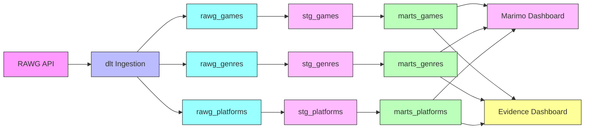
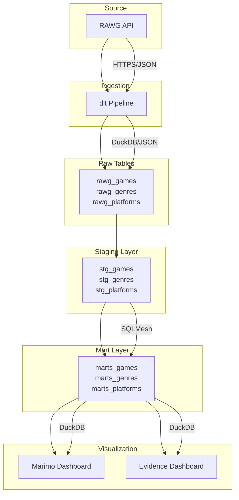

# Data Lineage

This document describes how data flows through the gaming analytics pipeline.

## Overview



## Layers

### 1. Source Layer

The pipeline ingests data from external APIs:

- **RAWG API**: Primary source for games, genres, and platforms data
- **HTTP**: RESTful API with pagination support
- **Rate Limiting**: Configurable retry logic with exponential backoff

### 2. Ingestion Layer

**Tool**: dlt (Data Load Tool)

- Extracts data from RAWG API in batches
- Handles schema inference automatically
- Supports both full and incremental loads
- Stores data in DuckDB with JSON fields preserved

**Tables**:
- `rawg_games` - Raw game data with nested JSON arrays
- `rawg_genres` - Genre metadata
- `rawg_platforms` - Platform metadata

### 3. Staging Layer

**Tool**: SQLMesh

Performs light transformations to prepare data for business logic:

**Transformations**:
- Type casting (e.g., strings to dates, JSON to arrays)
- NULL value handling with `TRY_CAST`
- Column naming standardization
- Data quality validation

**Tables**:
- `stg_games` - Cleaned game data
- `stg_genres` - Cleaned genre data
- `stg_platforms` - Cleaned platform data

### 4. Mart Layer

**Tool**: SQLMesh

Business-ready data with aggregations and derived metrics:

**Metrics Calculated**:
- `rating_category`: Excellent, Good, Average, Below Average, Poor
- `engagement_score`: Weighted combination of rating, metacritic, and ratings_count
- `release_year` / `release_month`: Extracted from release date
- `genre_count` / `platform_count` / `store_count`: Array lengths

**Tables**:
- `marts_games` - Enriched game analytics
- `marts_genres` - Aggregated genre statistics
- `marts_platforms` - Platform analytics

### 5. Visualization Layer

**Tools**: Marimo (reactive notebooks) and Evidence (SQL-native)

- **Marimo**: Interactive exploration with Python cells
- **Evidence**: Static dashboards with embedded SQL queries
- Both connect to the same DuckDB database

## Data Flow Diagram (Detailed)



## Key Transformations

### Games Pipeline

| Stage | Table | Key Transformations |
|--------|-------|-------------------|
| Ingestion | rawg_games | Schema inference, JSON preservation |
| Staging | stg_games | `TRY_CAST` for dates/numbers, NULL handling |
| Mart | marts_games | `UNNEST` for JSON arrays, rating categories, engagement score |

### Engagement Score Formula

```sql
COALESCE(rating, 0) * 0.4 +
COALESCE(metacritic, 0) / 10.0 * 0.3 +
COALESCE(ratings_count, 0) / 100.0 * 0.3 AS engagement_score
```

**Weights**:
- 40% User rating
- 30% Critical reception (Metacritic)
- 30% Community engagement (ratings count)

## Refresh Strategy

| Table | Materialization | Refresh |
|-------|----------------|---------|
| rawg_* | Append | Daily (incremental) or on-demand (full) |
| stg_* | Full | After raw data refresh |
| marts_games | Incremental | After staging refresh |
| marts_genres | Full | After staging refresh |
| marts_platforms | Full | After staging refresh |

## Quality Checks

**Soda Core** validates data at each layer:

- Staging: Schema validation, type checks, NULL constraints
- Marts: Business rule validation, statistical checks, referential integrity
