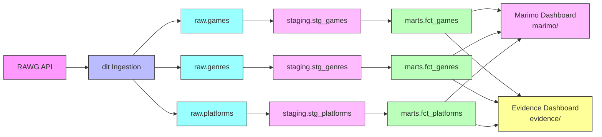
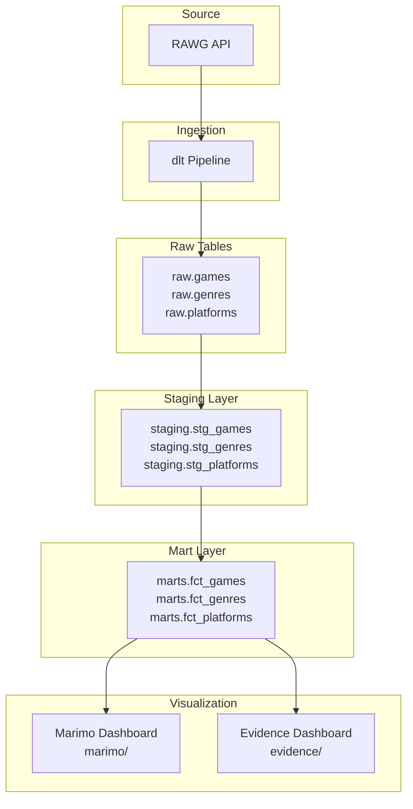

# Data Flow

This document describes how data flows through the gaming analytics pipeline.

## Overview


```mermaid
graph LR
    A[RAWG API] --> B[dlt Ingestion]
    B --> C[raw.games]
    B --> D[raw.genres]
    B --> E[raw.platforms]

    C --> F[staging.stg_games]
    D --> G[staging.stg_genres]
    E --> H[staging.stg_platforms]

    F --> I[marts.fct_games]
    G --> J[marts.fct_genres]
    H --> K[marts.fct_platforms]

    I --> L[Marimo Dashboard<br/>marimo/]
    J --> L
    K --> L
    I --> M[Evidence Dashboard<br/>evidence/]
    J --> M
    K --> M

    style A fill:#f9f,stroke:#333
    style B fill:#bbf,stroke:#333
    style C fill:#9ff,stroke:#333
    style D fill:#9ff,stroke:#333
    style E fill:#9ff,stroke:#333
    style F fill:#fbf,stroke:#333
    style G fill:#fbf,stroke:#333
    style H fill:#fbf,stroke:#333
    style I fill:#bfb,stroke:#333
    style J fill:#bfb,stroke:#333
    style K fill:#bfb,stroke:#333
    style L fill:#fbf,stroke:#333
    style M fill:#ff9,stroke:#333
```

## Layers

### 1. Source Layer

The pipeline ingests data from external APIs:

- **RAWG API**: Primary source for games, genres, and platforms data
- **HTTP**: RESTful API with pagination support
- **Rate Limiting**: Configurable retry logic with exponential backoff

### 2. Ingestion Layer

**Tool**: dlt (Data Load Tool)

- Extracts data from RAWG API in batches
- Handles schema inference automatically
- Supports both full and incremental loads
- Stores data in DuckDB with JSON fields preserved

**Tables**:

- `raw.games` - Raw game data with nested JSON arrays (genres, platforms)
- `raw.genres` - Genre metadata
- `raw.platforms` - Platform metadata

### 3. Staging Layer

**Tool**: SQLMesh

Performs light transformations to prepare data for business logic:

**Transformations**:

- Type casting (e.g., strings to dates, JSON to arrays)
- NULL value handling with `TRY_CAST`
- Column naming standardization

**Tables**:

- `staging.stg_games` - Cleaned game data (also preserves `genres` and `platforms` JSON columns)
- `staging.stg_genres` - Cleaned genre data
- `staging.stg_platforms` - Cleaned platform data

### 4. Mart Layer

**Tool**: SQLMesh

Business-ready data with aggregations and derived metrics:

**Tables**:

- `marts.fct_games` - Enriched game analytics with rating categories and engagement scores
- `marts.fct_genres` - Aggregated genre statistics
- `marts.fct_platforms` - Aggregated platform statistics

### 5. Visualization Layer

**Tools**: Marimo (reactive notebooks) and Evidence (markdown-first BI dashboards)

- **Marimo**: Interactive Python-based exploration with Plotly visualizations
- **Evidence**: Markdown-first BI with static HTML output, queries live DuckDB

## Detailed Flow


```mermaid
flowchart TD
    subgraph Source
        API[RAWG API]
    end

    subgraph Ingestion
        DLT[dlt Pipeline]
    end

    subgraph Raw Tables
        RAWG[raw.games<br/>raw.genres<br/>raw.platforms]
    end

    subgraph Staging Layer
        STG[staging.stg_games<br/>staging.stg_genres<br/>staging.stg_platforms]
    end

    subgraph Mart Layer
        MART[marts.fct_games<br/>marts.fct_genres<br/>marts.fct_platforms]
    end

    subgraph Visualization
        MARIMO[Marimo Dashboard<br/>marimo/]
        EVIDENCE[Evidence Dashboard<br/>evidence/]
    end

    API --> DLT
    DLT --> RAWG
    RAWG --> STG
    STG --> MART
    MART --> MARIMO
    MART --> EVIDENCE
```

## Key Transformations

### Games Pipeline

| Stage     | Table                | Key Transformations                                      |
| --------- | -------------------- | ------------------------------------------------------- |
| Ingestion | raw.games            | Schema inference, JSON preservation                      |
| Staging   | staging.stg_games    | `TRY_CAST` for dates/numbers, NULL handling             |
| Mart      | marts.fct_games      | Rating categories, engagement score, date extraction     |

### Engagement Score Formula

```sql
COALESCE(rating, 0) * 0.4 + COALESCE(ratings_count, 0) / 100.0 * 0.6 AS engagement_score
```

**Weights**:

- 40% User rating
- 60% Community engagement (ratings count)

### Genres/Platforms Aggregations

`marts.fct_genres` and `marts.fct_platforms` use DuckDB's `json_each` to explode the JSON arrays from `raw.games`, then aggregate by genre/platform name:

```sql
CROSS JOIN LATERAL json_each(gm_inner.genres) AS je
WHERE je.value->>'name' = g.name
```

## Refresh Strategy

| Table           | Materialization | Refresh                                 |
| --------------- | --------------- | --------------------------------------- |
| raw.\*         | Append          | Daily (incremental) or on-demand (full) |
| staging.\*     | View            | Recomputes on each query               |
| marts.fct_games | View            | Recomputes on each query               |
| marts.fct_genres | View            | Recomputes on each query               |
| marts.fct_platforms | View        | Recomputes on each query               |

## Quality Checks

**Soda Core** validates data at each layer via YAML contracts in `src/gaming_pipeline/quality/checks/`:

- **Raw layer** (`raw_games.yaml`, `raw_genres.yaml`, `raw_platforms.yaml`): Primary key uniqueness, null constraints, rating/range bounds, row count thresholds
- **Marts layer** (`fct_games.yaml`, `fct_genres.yaml`, `fct_platforms.yaml`): Column completeness, rating ranges, row counts

**SQLMesh tests** (`sqlmesh/tests/`) validate business logic in SQL:
- No null game names
- No release dates in the future
- Rating values within valid range

Soda contracts and SQLMesh tests are run together via `just soda-scan`.
