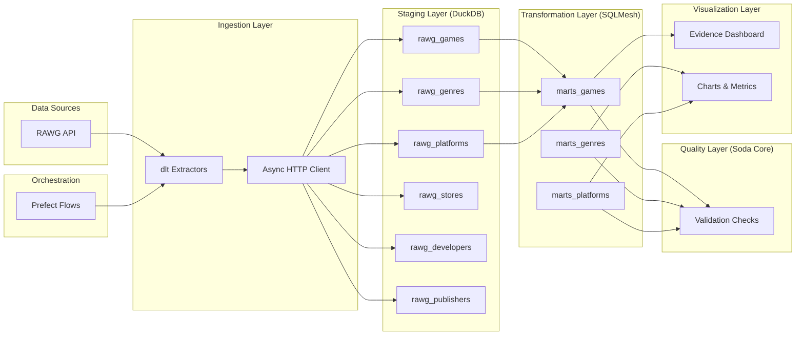

# Data Lineage Documentation

This document describes the data flow and transformations in the Gaming Analytics Pipeline.

## Overview

The pipeline follows a modern ELT (Extract, Load, Transform) pattern with data quality checks and visualization.

## Data Flow Diagram



## Detailed Data Flow

### 1. Extraction Phase

**Source**: RAWG API

- Endpoints: Games, Genres, Platforms, Stores, Developers, Publishers
- Authentication: API Key
- Rate Limiting: Configurable page size and delays

**Tools**:

- `dlt` for data extraction
- Async HTTP client for parallel requests
- Pydantic models for schema validation

### 2. Loading Phase

**Destination**: DuckDB (`data/gaming_analytics.duckdb`)

- Schema: `gaming_analytics`
- Write Strategies:
  - `rawg_genres`, `rawg_platforms`: Replace (full refresh)
  - `rawg_games`: Append (incremental)

**Tables Created**:

- `rawg_games`: Raw game data with all API fields
- `rawg_genres`: Genre reference data
- `rawg_platforms`: Platform reference data
- `rawg_stores`: Store reference data
- `rawg_developers`: Developer reference data
- `rawg_publishers`: Publisher reference data

### 3. Transformation Phase

**Tool**: SQLMesh
**Materialization**: Tables (configurable to views)

#### Mart: Games (`marts_games`)

- **Sources**: `rawg_games`, `rawg_genres`, `rawg_platforms`
- **Transformations**:
  - Denormalize genre information
  - Aggregate platform data
  - Calculate derived metrics (rating tiers, release categories)
  - Filter and clean data

#### Mart: Genres (`marts_genres`)

- **Sources**: `rawg_games`, `rawg_genres`
- **Transformations**:
  - Aggregate game counts per genre
  - Calculate average ratings
  - Trend analysis over time

#### Mart: Platforms (`marts_platforms`)

- **Sources**: `rawg_games`, `rawg_platforms`
- **Transformations**:
  - Aggregate game counts per platform
  - Platform popularity metrics
  - Cross-platform game analysis

### 4. Quality Phase

**Tool**: Soda Core
**Checks**:

- Row count validation
- Null value checks
- Value range validation
- Freshness checks
- Schema validation

**Configuration Files**:

- `src/gaming_pipeline/quality/checks/staging.yml`: Staging table checks
- `src/gaming_pipeline/quality/checks/marts.yml`: Mart table checks

### 5. Visualization Phase

**Tool**: Evidence.dev
**Pages**:

- `index.md`: Overview dashboard with quick stats
- `games.md`: Detailed game analytics
- `genres.md`: Genre analysis and trends
- `platforms.md`: Platform performance metrics
- `trends.md`: Historical trend analysis

## Data Dependencies

```text
rawg_games
├── → marts_games (primary)
├── → marts_genres (genre aggregation)
└── → marts_platforms (platform aggregation)

rawg_genres
├── → marts_games (genre enrichment)
└── → marts_genres (primary)

rawg_platforms
├── → marts_games (platform enrichment)
└── → marts_platforms (primary)
```

## Orchestration

**Tool**: Prefect 3.x

### Flows

1. **Daily Pipeline** (`daily_pipeline_flow`)
   - Extract recent data (last N days)
   - Load to staging
   - Run transformations
   - Execute quality checks
   - Update dashboard

2. **Full Load** (`full_load_pipeline_flow`)
   - Extract all historical data
   - Full load to staging
   - Run all transformations
   - Execute quality checks
   - Update dashboard

### Tasks

- `extract_rawg_data`: Fetch data from API
- `load_to_duckdb`: Store data in database
- `run_transformations`: Execute SQLMesh models
- `validate_data`: Run Soda checks
- `update_dashboard`: Refresh Evidence.dev

## Data Freshness

- **Staging Tables**: Updated on daily/weekly basis
- **Mart Tables**: Recomputed after staging updates
- **Dashboard**: Updated after successful transformation

## Data Retention

See `docs/data-retention.md` for retention policies.

## Troubleshooting

### Data Not Appearing in Dashboard

1. Check if staging tables have data: `python main.py status`
2. Verify transformations ran successfully
3. Check Evidence dashboard build logs

### Quality Check Failures

1. Review Soda check results in logs
2. Investigate data quality issues
3. Update checks if thresholds are too strict

### Pipeline Stuck

1. Check Prefect UI for task status
2. Review logs in `logs/pipeline.log`
3. Verify API rate limits not exceeded
